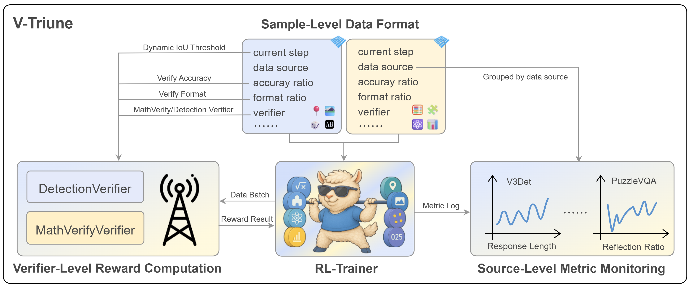

<div align="center">
  <picture>
    <source srcset="assets/minimax-logo.png" media="(prefers-color-scheme: dark)">
      
    </source>
  </picture>
</div>
<hr>

<div align="center" style="line-height: 1;">
  <a href="./MiniMax-One-RL-to-See-Them-All-v250523.pdf" target="_blank" style="margin: 2px;">
  
</a>
<a href="https://arxiv.org/abs/2505.18129" target="_blank" style="margin: 2px;">
  
</a>
<a href="https://huggingface.co/One-RL-to-See-Them-All" target="_blank" style="margin: 2px;">
  
</a>
<a href="https://huggingface.co/datasets/One-RL-to-See-Them-All/Orsta-Data-47k" target="_blank" style="margin: 2px;">
  
</a>
<a href="https://github.com/MiniMax-AI/One-RL-to-See-Them-All/blob/main/LICENSE" style="margin: 2px;">
  
</a>
</div>

<hr>

# One RL to See Them All
We propose **V-Triune** (**V**isual **Tri**ple **U**nified Rei**n**forcement L**e**arning), a unified Reinforcement Learning (RL) system designed to advance Vision-Language Models (VLMs). It enables VLMs to jointly learn and master both visual reasoning and perception tasks within a single training pipeline. Our model, Orsta, trained with this approach, demonstrates how one RL framework can empower VLMs to "**See Them All**", delivering significant performance boosts across a diverse range of visual tasks.

<div align="center">
  <picture>
    <source srcset="assets/main-figure.png" media="(prefers-color-scheme: dark)">
      
    </source>
  </picture>
  <br> <i>Figure 1: High-level overview of Orsta's capabilities.</i> </div>

V-Triune consists of three complementary components: **Sample-Level Data Formatting** (unifies diverse task inputs), **Verifier-Level Reward Computation** (delivers custom rewards via specialized verifiers), and **Source-Level Metric Monitoring** (diagnoses problems at the data-source level).

<div align="center">
  <picture>
    <source srcset="assets/main-framework.png" media="(prefers-color-scheme: dark)">
      
    </source>
  </picture>
  <br> <i> Figure 2: The V-Triune Framework. </i>
</div>

## Key Features

What makes V-Triune and Orsta stand out:

* **Unified RL Framework 🤖**: V-Triune is the *first* system to enable VLMs to jointly master visual reasoning (e.g., Math, Puzzles) and perception (e.g., Detection, Grounding) within a *single*, streamlined RL training pipeline.
* **High-Performance Orsta Models 🚀**: Trained using our V-Triune system on **8 diverse tasks** (4 reasoning + 4 perception), Orsta models (ranging from 7B to 32B) achieve *substantial* performance gains—**up to +14.1%** on the comprehensive MEGA-Bench Core—demonstrating the effectiveness and scalability of our unified approach.
* **Novel Dynamic IoU Reward 🎯**: We introduce an *innovative* Dynamic IoU reward mechanism that provides adaptive, progressive feedback. This significantly improves stability and performance, particularly on challenging visual perception tasks.
* **Open & Accessible 🌐**: Both the V-Triune system and the high-performance Orsta models are publicly available, encouraging further research and development in VLM training.
## News

* **[2025/05/23]** 🎉 We are excited to release our technical report! You can read the paper [here](https://arxiv.org/abs/2505.18129).

## Main Results

Below we present the main results for our Orsta models, focusing on training dynamics and performance specifically on the MEGA-Bench Core benchmark.

<div align="center">
  
  <br>
  <i><b>Figure 3:</b> Training Trends of On-Policy vs Off-Policy Across Three Model Variants on MEGA Bench core (7B, 32B-0321, 32B-0326). Models are evaluated every 5 steps from step 0 to 135. Starting points and peak performances are annotated on the curves.</i>
</div>

<br>

<div align="center">
  
  <br>
  <i><b>Figure 4:</b> Training Trends of Orsta-32B 0321 across MEGA-Bench core Task Variants. The dark line denotes the overall MEGA-Bench Core score.</i>
</div>

# 🚀 Get Started

<summary><strong>Introduction</strong></summary>

This guide will walk you through setting up the environment, installing necessary dependencies, configuring a Ray cluster, and setting up experiment parameters to run *One-RL-to-See-Them-All*.

---

<details open>
<summary><strong>🛠️ Installation</strong></summary>

Follow these steps to prepare your environment and install the required packages.

We provide `Dockerfile` in the `docker/` directory for containerized setup. Alternatively, you can configure your environment using Conda as described below.

1.  **Create and Activate Conda Environment:**
    We recommend using Python 3.12.
    ```bash
    conda create -n v_triune python=3.12
    source activate v_triune
    ```

2.  **Install PyTorch (CUDA 12.4):**
    This project is optimized for PyTorch 2.6.0 with CUDA 12.4 support.
    ```bash
    pip install torch==2.6.0 torchvision==0.21.0 torchaudio==2.6.0 --index-url https://download.pytorch.org/whl/cu124
    ```

3.  **Install FlashAttention:**
    FlashAttention (version 2.7.3) is used for efficient attention mechanisms. Ensure `ninja` is correctly installed.
    ```bash
    pip uninstall -y ninja && pip install ninja
    pip install flash-attn==2.7.3 --no-build-isolation
    ```

4.  **Install v_triune:**
    Clone the *One-RL-to-See-Them-All* repository and install it in editable mode.
    ```bash
    git clone https://github.com/MiniMax-AI/One-RL-to-See-Them-All.git
    cd One-RL-to-See-Them-All
    pip install -e .
    ```

</details>

---

<details>
<summary><strong>📦 Data Preparation</strong></summary>

This section outlines how to download and structure the Orsta-Data-47k dataset.

**1. Download Dataset:**

Download the dataset using the Hugging Face CLI:

```bash
huggingface-cli download \
    --repo-type dataset \
    --resume-download \
    One-RL-to-See-Them-All/Orsta-Data-47k \
    --local-dir Orsta-Data-47k
```

**2. Dataset Structure & Format:**
All data files are in Parquet (.parquet) format. The Orsta-Data-47k directory will be structured as:

```
Orsta-Data-47k/
├── test/
│   ├── test_chart_megabench_176.parquet
│   └── ... (other test files)
└── train/
    ├── train_chart_chartqapro_498.parquet
    └── ... (other train files)
```

**3. File Naming:**

Files follow the convention: `{split}_{task_name}_{source_name}_{num}.parquet`

`{split}`: train or test.
`{task_name}`: General task category (e.g., chart, science).
`{source_name}`: Specific data benchmark/origin.
`{num}`: Number of samples in the file.

**4. Split Usage:**

`train/`: Corpus for training the model.

`test/`: Samples for online evaluation during training, used to diagnose learning progress per task.

</details>

---

<details>
<summary><strong>🌐 Ray Cluster Setup</strong></summary>

For distributed training, set up a Ray cluster. Here's an example for a 2-node cluster, each with 8 GPUs.

1.  **Start the Head Node:**
    Run this command on your designated head node. The dashboard will be accessible via `http://<head_node_ip>:8265`.
    ```bash
    ray start --head --dashboard-host=0.0.0.0
    ```
    Note down the address provided (e.g., `xxxxxx:6379`).

2.  **Start Worker Node(s):**
    Run this command on each worker node, replacing `xxxxxx:6379` with the address from the head node.
    ```bash
    ray start --address=xxxxxx:6379
    ```

3.  **Verify Cluster Status:**
    On the head node, run `ray status` to confirm that all nodes have joined and all GPUs (16 in this example) are detected.

</details>

---

<details>
<summary><strong>🏆 Reward Server</strong></summary>


This section describes how to launch a remote reward server, which is used to calculate reward values during the training process.

To start the reward server, execute the following command:

```bash
bash scripts/reward_server.sh
```

This script utilizes several configurable parameters:

`DET_IOU_THRESHOLD`: Defines the threshold strategy for the Intersection over Union (IoU) reward.

`PORT`: Specifies the network port on which the reward server will listen for incoming requests.

`WORKERS`: Sets the number of worker processes for the server.

Upon successful execution, the script launches a FastAPI service. A file named with a unique `JOB_ID` will be created within the `.reward_server/` directory in your project. This `JOB_ID` file contains the `IP` address and `PORT` of the running reward server (e.g., your_server_ip:8192).

**Important**: Take note of this **JOB_ID**, as it will be required for configuring the training process later.

</details>

---

<details>
<summary><strong>⚙️ Experiment Parameters</strong></summary>

For a comprehensive list of all configurable parameters and hyperparameters, please refer to the `scripts/train.sh` file.

Before running experiments, configure the environment variables to match your Ray cluster setup.

* **Set Node and GPU Counts:**
    Adjust these values based on your actual cluster configuration (e.g., for 2 nodes and 8 GPUs per node):
    ```bash
    export NUM_NODES=2
    export GPUS_PER_NODE=8
    ```
* **Configure Reward Server Job ID:**
    Set `REMOTE_REWARD_JOB_ID` to the identifier(s) of your previously launched reward server(s). This enables the training pipeline to locate the reward server's address.
    ```bash
    export REMOTE_REWARD_JOB_ID="j-xxxxxxxxxx"
    ```
    If you are using multiple reward servers, provide their `JOB_ID`s concatenated with a `|` (pipe) delimiter:
    ```bash
    export REMOTE_REWARD_JOB_ID="j-xxxxxxxxxx|j-yyyyyyyyyy|j-zzzzzzzzzz"
    ```
* **Set Training and Online Test Data Files:**
    Based on the dataset you downloaded (e.g., into `Orsta-Data-47k`), specify the paths for your training and online test files. The format is a string containing a comma-separated list of file paths, enclosed in brackets.
    For example:
    ```bash
    export DATA_TRAIN_FILE="[/path/to/your/Orsta-Data-47k/train/train_math_mmmath_3539.parquet,/path/to/your/Orsta-Data-47k/train/train_detection_v3det_4000.parquet]"
    export DATA_TEST_FILE="[/path/to/your/Orsta-Data-47k/test/test_math_megabench_237.parquet,/path/to/your/Orsta-Data-47k/test/test_detection_coco_test_multi_2000.parquet]"
    ```
    **Note:** Replace `[/path/to/your/Orsta-Data-47k/...]` with the actual absolute or relative paths to your dataset files based on where you downloaded and stored the `Orsta-Data-47k` directory.
* **Model Loading and Checkpointing:**
    Configure paths for loading initial model weights and saving training states, along with the save frequency.
    * `ACTOR_LOAD_PATH`: Path to the initial model checkpoint to load.
    * `TRAIN_SAVE_FREQ`: Frequency to save the training state (e.g., `5` for every 5 steps, `-1` for do not save).
    * `TRAIN_SAVE_PATH`: Directory where training checkpoints will be stored.
    
    For example:
    ```bash
    export ACTOR_LOAD_PATH="/verl_model/Qwen2.5-VL-7B-Instruct"
    export TRAIN_SAVE_FREQ="5"
    export TRAIN_SAVE_PATH="/verl_exp"
    ```
* **PPO Training Parameters:**
    Define batch sizes for PPO updates and related calculations. These settings include default values if not explicitly overridden.
    * `ACTOR_PPO_GLOBAL_BSZ`: Total number of samples used for a single PPO update across all workers. Defaults to `1024`.
    * `ACTOR_PPO_MICRO_BSZ`: Number of samples in each micro-batch for the PPO loss calculation. This helps manage memory usage, especially with large models, to prevent Out-of-Memory (OOM) errors. Defaults to `16`.
    * `LOG_P_MICRO_BSZ`: Micro-batch size specifically for log-probability calculations. Defaults to `32`.
    
    For example:
    ```bash
    export ACTOR_PPO_GLOBAL_BSZ="1024"
    export ACTOR_PPO_MICRO_BSZ="16"
    export LOG_P_MICRO_BSZ="32"
    ```
* **Data Configuration:**
    Set parameters related to data batching for training and testing, and the maximum length for generated responses.
    * `DATA_TRAIN_BATCH_SIZE`: Number of prompts for which responses are generated in each training batch.
    * `DATA_TEST_BATCH_SIZE`: Number of samples to evaluate at once during testing (across all specified `DATA_TEST_FILE`s).
    * `DATA_MAX_RES_LENGTH`: Maximum token length allowed for each generated response.

    For example:
    ```bash    
    export DATA_TRAIN_BATCH_SIZE="1024"
    export DATA_TEST_BATCH_SIZE="4096"
    export DATA_MAX_RES_LENGTH="2048"
    ```
* **Learning Rate and Optimization:**
    Configure the learning rate for the actor model and specify which parts of the model should have their weights frozen during training.
    * `ACTOR_LR`: Sets the learning rate for the actor model.
    * `ACTOR_LR_FREEZE`: Specifies parts of the model whose weights will be frozen (not updated) during training. This can be an empty string for no frozen parts, or a string representing a list of component names (e.g., `"[vit,connector]"` or `['vit', 'connector', 'llm']` depending on how it's parsed by the script).
    
    For example:
    ```bash
    export ACTOR_LR="1e-6"
    export ACTOR_LR_FREEZE="[vit,connector]"
    ```
* **Rollout Configuration:**
    Set parameters that control the generation of rollout sequences by the actor model.
    * `ROLLOUT_N`: Specifies the number of distinct rollout sequences to generate per query.
    * `ROLLOUT_TEMP`: Controls the temperature during generation.
    * `ROLLOUT_TP_SIZE`: Defines the tensor parallelism size for the rollout model.

    For example:
    ```bash
    export ROLLOUT_N="8"
    export ROLLOUT_TEMP="1.0"
    export ROLLOUT_TP_SIZE="1"
    ```
* **Evaluation Configuration:**
    Configure parameters for the evaluation process. These settings include default values that are used if the variables are not explicitly set.
    * `EVAL_BEFORE_TRAIN`: Determines whether to run an evaluation cycle before the training process begins.
    * `EVAL_DO_SAMPLE`: Specifies if sampling should be used during evaluation generation.
    * `EVAL_TEMP`: Sets the temperature for generation during evaluation.
    * `EVAL_TOPP`: Defines the top-p sampling parameter for evaluation.
 
    For example:
    ```bash
    export EVAL_BEFORE_TRAIN=True
    export EVAL_DO_SAMPLE=False
    export EVAL_TEMP=0
    export EVAL_TOPP=1
    ```
* **Training Run Configuration:**
    General settings for managing the training process, including project identification, evaluation scheduling, training duration, and experiment tracking with Weights & Biases.
    * `TRAIN_PROJECT_NAME`: Specifies the project name.
    * `TRAIN_TEST_FREQ`: Defines the frequency (step) for running evaluations on the test set during training.
    * `TRAIN_TOTAL_EPOCHS`: The total number of epochs the training process will run for.
    * `WANDB_API_KEY`: Your personal Weights & Biases API key. This is required if you intend to log results and metrics to W&B. **Remember to replace `"your wandb api key"` with your actual key.**
 
    For example:
    ```bash
    export TRAIN_PROJECT_NAME="v_triune"
    export TRAIN_TEST_FREQ="5"
    export TRAIN_TOTAL_EPOCHS="3"
    export WANDB_API_KEY="your wandb api key"
    ```
</details>

---

## Roadmap

We are committed to sharing our work with the community and plan to release additional components over time. Here's our current plan:

- [x] 🚀 **Getting Started Guide** (Released: May 31, 2025)
- [x] 💻 **V-Triune Code** (Released: May 31, 2025)
- [x] 📊 **Training Data** (Released: May 31, 2025)
- [x] 🤗 **Model Weights** (Released: May 25, 2025)
- [x] 📄 **Technical Report** (Released: May 23, 2025)

We are working hard to make these available. Stay tuned for further updates!


## Citation
Please cite our paper if you find our work helpful:
```bibtex
@article{ma2025one,
      title={One RL to See Them All: Visual Triple Unified Reinforcement Learning}, 
      author={Ma, Yan and Du, Linge and Shen, Xuyang and Chen, Shaoxiang and Li, Pengfei and Ren, Qibing and Ma, Lizhuang and Dai, Yuchao and Liu, Pengfei and Yan, Junjie},
      journal={arXiv preprint arXiv:2505.18129},
      year={2025}
}
```
