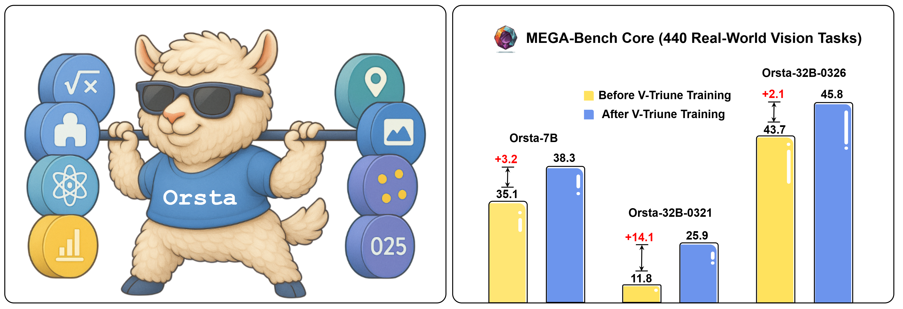

  <picture>
    <source srcset="assets/minimax-logo.png" media="(prefers-color-scheme: dark)">
      
    </source>
  </picture>

  

# One RL to See Them All
We propose **V-Triune** (**V**isual **Tri**ple **U**nified Rei**n**forcement L**e**arning), a unified Reinforcement Learning (RL) system designed to advance Vision-Language Models (VLMs). It enables VLMs to jointly learn and master both visual reasoning and perception tasks within a single training pipeline. Our model, Orsta, trained with this approach, demonstrates how one RL framework can empower VLMs to "**See Them All**", delivering significant performance boosts across a diverse range of visual tasks.

  <picture>
    <source srcset="assets/main-figure.png" media="(prefers-color-scheme: dark)">
      
    </source>
  </picture>
    <i>Figure 1: High-level overview of Orsta's capabilities.</i> 

V-Triune consists of three complementary components: **Sample-Level Data Formatting** (unifies diverse task inputs), **Verifier-Level Reward Computation** (delivers custom rewards via specialized verifiers), and **Source-Level Metric Monitoring** (diagnoses problems at the data-source level).

  <picture>
    <source srcset="assets/main-framework.png" media="(prefers-color-scheme: dark)">
      
    </source>
  </picture>
    <i> Figure 2: The V-Triune Framework. </i>

## Key Features

What makes V-Triune and Orsta stand out:

* **Unified RL Framework 🤖**: V-Triune is the *first* system to enable VLMs to jointly master visual reasoning (e.g., Math, Puzzles) and perception (e.g., Detection, Grounding) within a *single*, streamlined RL training pipeline.
* **High-Performance Orsta Models 🚀**: Trained using our V-Triune system on **8 diverse tasks** (4 reasoning + 4 perception), Orsta models (ranging from 7B to 32B) achieve *substantial* performance gains—**up to +14.1%** on the comprehensive MEGA-Bench Core—demonstrating the effectiveness and scalability of our unified approach.
* **Novel Dynamic IoU Reward 🎯**: We introduce an *innovative* Dynamic IoU reward mechanism that provides adaptive, progressive feedback. This significantly improves stability and performance, particularly on challenging visual perception tasks.
* **Open & Accessible 🌐**: Both the V-Triune system and the high-performance Orsta models are publicly available, encouraging further research and development in VLM training.
## News

* **[2025/05/23]** 🎉 We are excited to release our technical report! You can read the paper [here](./MiniMax-One-RL-to-See-Them-All-v250523.pdf).

## Main Results

Below we present the main results for our Orsta models, focusing on training dynamics and performance specifically on the MEGA-Bench Core benchmark.

  
   
  <i><b>Figure 3:</b> Training Trends of On-Policy vs Off-Policy Across Three Model Variants on MEGA Bench core (7B, 32B-0321, 32B-0326). Models are evaluated every 5 steps from step 0 to 135. Starting points and peak performances are annotated on the curves.</i>

 

  
   
  <i><b>Figure 4:</b> Training Trends of Orsta-32B 0321 across MEGA-Bench core Task Variants. The dark line denotes the overall MEGA-Bench Core score.</i>

## Roadmap

We are committed to sharing our work with the community and plan to release additional components over time. Here's our current plan:

- [ ] 🚀 **Getting Started Guide** (Coming Soon)
- [ ] 💻 **V-Triune Code** (Coming Soon)
- [ ] 📊 **Training Data** (Coming Soon)
- [ ] 🤗 **Model Weights** (Coming Soon)
- [x] 📄 **Technical Report** (Released: May 23, 2025)

We are working hard to make these available. Stay tuned for further updates!
